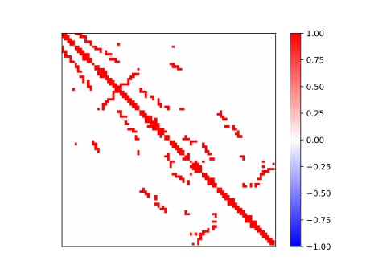

# Draw Mtx As Thumbnail - 将Mtx画为缩略图

## 安装依赖

```shell
pip3 install -r requirements.txt
```

## 运行

```shell
python3 main.py <aver | abs | real | log...> [-one <*.mtx>] [--set-log-times <n: int>] [--force]
```

如果你安装了[QuickProject](https://github.com/Rhythmicc/QuickProject):

```shell
qrun <aver | abs | real | log...> [-one <*.mtx>] [--set-log-times <n: int>] [--force]
```

| 参数                         | 说明                                                         |
| ---------------------------- | ------------------------------------------------------------ |
| `<aver, abs, real, log>`  | 选择绘图算法, 目前支持针对子矩阵元素和取均值、取绝对值（正值为1，负值为-1）、不做处理、取若干次log |
| `[-one <*.mtx>]`             | 放弃自动搜索，指定一个mtx文件开始画                          |
| `[--set-log-times <n: int>]` | 设置log算法的取log次数，默认两次                             |
| `[--force]`                  | 强制覆盖已有的画图结果                                       |

### 例子

```shell
qrun aver abs log real -one 2.mtx --set-log-times 0 --force # 一次性绘制2.mtx的四种图，log取0次，强制替换
qrun aver abs log --force # 绘制当前目录及子目录下的全部mtx文件的三种图，强制替换
```

### 特殊说明

子矩阵划分方式：当行列不相等时，较大的属性被分为`matSize`块，较小的属性为`rate * matSize`块；其中`rate`为$ min(m,n)/max(m,n) $

## 样例

|     <br />平均值     |    <br />不处理    |
| :--------------------------------------------: | :------------------------------------------: |
| <br /><b>取0次log</b> | <br /><b>绝对值</b> |

