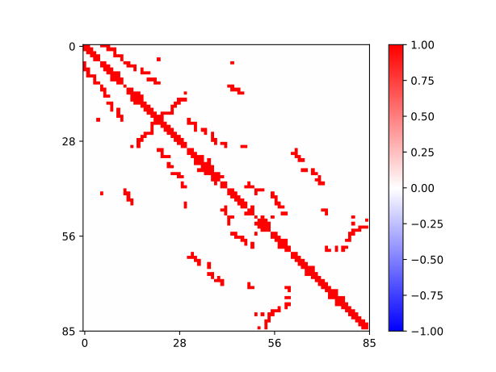
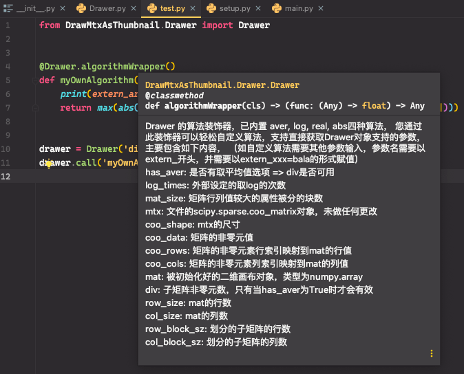

# Draw Mtx As Thumbnail - 将 Mtx 画为缩略图


## 样例

|      <br />平均值      |   <br />不处理    |
| :-------------------------------------------------: | :--------------------------------------------: |
| <br /><b>取 0 次 log</b> | <br /><b>绝对值</b> |

## 安装

```shell
pip3 install MtxDrawer -U
```

自动安装依赖并注册一个命令`mtx-drawer`

【注意】：由于依赖库的版本更新可能导致旧版本不再能运行，请注意保持此工具为最新版本。

## 运行

```shell
mtx-drawer draw-one [--force] [--log-times <n: int>] [--mat-size <n: int>] [--block-size <n: int>] <filepath> <-ops <aver | abs | real | log>... >
mtx-drawer draw [--force] [--log-times <n: int>] [--mat-size <n: int>] [--block-size <n: int>] <-ops <aver | abs | real | log>... >
```

### 解释

1. 第一条命令是为文件`<filepath>`画缩略图 (`filepath`无需是 mtx 文件，但需要能被`scipy.io.mmread`读取)，其中`<ops>`是<font color="red">必填的多选参数</font>只能在命令末尾赋值，用于指定缩略图的类型，其中`<aver>`表示平均值，`<abs>`表示绝对值，`<real>`表示实际值，`<log>`表示对数值进行对数变换; `force`表示强制重新画缩略图默认为否，`log-times`表示画缩略图对像素值取 log 的次数默认为 2，`mat-size`表示缩略图的尺寸（默认是 200 \* 200 的图像），`block-size`直接设置块大小（开启次选项后将覆盖掉`mat-size`参数）。
2. 第二条命令会递归搜索当前路径下的所有 mtx 文件并绘制缩略图，参数含义与上一条描述一致。

注意: ops 作为必填多选参数，必须在命令的末尾为其赋值，否则会报错。

### 例子

```shell
mtx-drawer draw-one 2.mtx --force --log-times 0 -ops aver abs log real # 一次性绘制2.mtx的四种图，log取0次，强制替换
mtx-drawer draw-one 2.mtx  -ops aver abs log real # 一次性绘制2.mtx的四种图，log取2次，不强制替换
mtx-drawer draw --force -ops aver abs log # 绘制当前目录及子目录下的全部mtx文件的三种图，强制替换
mtx-drawer draw -ops aver abs log real # 绘制当前目录及子目录下的全部mtx文件的三种图，不强制替换且log取2次
```

### 特殊说明

子矩阵划分方式：当行列不相等时，较大的属性被分为`matSize`块，较小的属性为`rate * matSize`块；其中`rate`为$ min(m,n)/max(m,n) $

### 命令行补全

基于[QuickProject.Commmander](https://github.com/Rhythmicc/QuickProject)开发的命令行 APP 可以提供 zsh 或 [fig](https://fig.io/) 的补全脚本：

```sh
mtx-drawer complete
```

效果：


## 基于 Drawer 类的自定义开发

当默认提供的四种算法无法满足需要时，可以按如下方式自行设计算法：

```python
from MtxDrawer.Drawer import Drawer

"""
您可以通过如下方式自定义算法并通过Drawer对象的call方法来调用；
自定义算法可接受的参数将在下表中说明，此外，自定义算法必须返回一个数值用于表示color_bar的显示范围（返回1则表示-1~1）
"""

@Drawer.algorithmWrapper() # 算法装饰器
def myOwnAlgorithm(mat, extern_arg): # 参数命名要符合下表的要求，mat是下表第9项，extern_arg是下表第15项
    print(extern_arg)
    return max(abs(max([max(i) for i in mat])), abs(min([min(i) for i in mat])))


drawer = Drawer('dist/2.mtx', False, set_log-times=0, force_update=True)
drawer.call('myOwnAlgorithm', extern_arg=1)

"""
---结果---

[信息] 路径模板: "dist/2_{}.svg"
1
[信息] absVal = 1
"""
```

| 序号 | 合法参数       | 说明                                               |
| :--: | -------------- | -------------------------------------------------- |
|  1   | `has_aver`     | 是否有取平均值选项 => div 是否可用                 |
|  2   | `log-times`    | 外部设定的取 log 的次数                            |
|  3   | `mat-size`     | 矩阵行列值较大的属性被分的块数                     |
|  4   | `mtx`          | 文件的 scipy.sparse.coo\*matrix 对象，未做任何更改 |
|  5   | `coo_shape`    | mtx 的尺寸                                         |
|  6   | `coo_data`     | 矩阵的非零元值                                     |
|  7   | `coo_rows`     | 矩阵的非零元素行索引映射到 mat 的行值              |
|  8   | `coo_cols`     | 矩阵的非零元素列索引映射到 mat 的列值              |
|  9   | `mat`          | 被初始化好的二维画布对象，类型为 numpy.array       |
|  10  | `div`          | 子矩阵非零元数，只有当 has_aver 为 True 时才会有效 |
|  11  | `row_size`     | mat 的行数                                         |
|  12  | `col_size`     | mat 的列数                                         |
|  13  | `row_block_sz` | 划分的子矩阵的行数                                 |
|  14  | `col_block_sz` | 划分的子矩阵的列数                                 |
|  15  | `extern_*`     | 额外的参数命名方式，需以"extern_xx=bala"的方式调用 |

### 现代 IDE 下的提示


