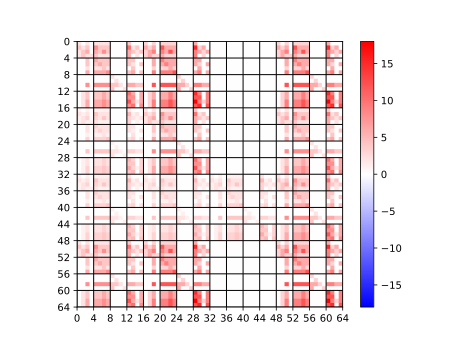

# Draw Mtx As Thumbnail - 将 Mtx 画为缩略图


## 样例

|      <br />平均值      |   <br />不处理    |
| :-------------------------------------------------: | :--------------------------------------------: |
| <br /><b>取 0 次 log</b> | <br /><b>绝对值</b> |

## 安装

```shell
pip3 install MtxDrawer -U
```

安装预览版，支持并行画图:

```shell
pip3 install git+https://github.com/Rhythmicc/DrawMtxAsThumbnail.git
# 可以添加parallel标志来启用并行画图
# mtx-drawer draw --parallel 
```

安装后可以使用命令`mtx-drawer`

## 子命令与参数

包含两个子命令 `draw-one` 和 `draw`，可以在终端中通过`mtx-drawer`命令查看，二者区别是`draw-one`只会处理一个文件，而`draw`会递归处理当前目录下的所有 mtx 文件。

### 参数

1. `[--force]`: 强制替换已存在的缩略图
2. `[--log-times <n: int>]`: 对缩略图的像素值取 log 的次数
3. `[--mat-size <n: int>]`: 缩略图的尺寸
4. `[--block-size <n: int>]`: 直接设置子矩阵块的大小
5. `[--tick-step <n: int>]`: 设置 x 轴和 y 轴的刻度间隔，启用后会绘制网格线，类似下图：
   

   ```shell
   mtx-drawer draw --block-size 1 --tick-step 4 --force -ops real
   ```

6. `<filepath>`: mtx 文件的路径 (`draw-one`子命令中必填)
7. `<-ops <aver | abs | real | log | ... >>`: 缩略图的类型，其中`<aver>`表示平均值，`<abs>`表示绝对值，`<real>`表示实际值，`<log>`表示对数值进行对数变换

## 运行例子

```shell
mtx-drawer draw-one 2.mtx --force --log-times 0 -ops aver abs log real # 一次性绘制2.mtx的四种图，log取0次，强制替换
mtx-drawer draw-one 2.mtx  -ops aver abs log real # 一次性绘制2.mtx的四种图，log取2次，不强制替换
mtx-drawer draw --force -ops aver abs log # 绘制当前目录及子目录下的全部mtx文件的三种图，强制替换
mtx-drawer draw -ops aver abs log real # 绘制当前目录及子目录下的全部mtx文件的三种图，不强制替换且log取2次
```

### 特殊说明

子矩阵划分方式：当行列不相等时，较大的属性被分为`matSize`块，较小的属性为`rate * matSize`块；其中`rate`为$ min(m,n)/max(m,n) $

### 命令行补全

基于[QuickProject.Commmander](https://github.com/Rhythmicc/QuickProject)开发的命令行 APP 可以提供 zsh 或 [fig](https://fig.io/) 的补全脚本：

```sh
mtx-drawer complete
```

## 基于 Drawer 类的自定义开发

当默认提供的四种算法无法满足需要时，可以按如下方式自行设计算法：

```python
from MtxDrawer.Drawer import Drawer

"""
您可以通过如下方式自定义算法并通过Drawer对象的call方法来调用；
自定义算法可接受的参数将在下表中说明，此外，自定义算法必须返回一个数值用于表示color_bar的显示范围（返回1则表示-1~1）
"""

@Drawer.algorithmWrapper() # 算法装饰器
def myOwnAlgorithm(mat, extern_arg): # 参数命名要符合下表的要求，mat是下表第9项，extern_arg是下表第15项
    print(extern_arg)
    return max(abs(max([max(i) for i in mat])), abs(min([min(i) for i in mat])))


drawer = Drawer('dist/2.mtx', False, set_log-times=0, force_update=True)
drawer.call('myOwnAlgorithm', extern_arg=1)

"""
---结果---

[信息] 路径模板: "dist/2_{}.svg"
1
[信息] absVal = 1
"""
```

| 序号 | 合法参数       | 说明                                               |
| :--: | -------------- | -------------------------------------------------- |
|  1   | `has_aver`     | 是否有取平均值选项 => div 是否可用                 |
|  2   | `log-times`    | 外部设定的取 log 的次数                            |
|  3   | `mat-size`     | 矩阵行列值较大的属性被分的块数                     |
|  4   | `mtx`          | 文件的 scipy.sparse.coo\*matrix 对象，未做任何更改 |
|  5   | `coo_shape`    | mtx 的尺寸                                         |
|  6   | `coo_data`     | 矩阵的非零元值                                     |
|  7   | `coo_rows`     | 矩阵的非零元素行索引映射到 mat 的行值              |
|  8   | `coo_cols`     | 矩阵的非零元素列索引映射到 mat 的列值              |
|  9   | `mat`          | 被初始化好的二维画布对象，类型为 numpy.array       |
|  10  | `div`          | 子矩阵非零元数，只有当 has_aver 为 True 时才会有效 |
|  11  | `row_size`     | mat 的行数                                         |
|  12  | `col_size`     | mat 的列数                                         |
|  13  | `row_block_sz` | 划分的子矩阵的行数                                 |
|  14  | `col_block_sz` | 划分的子矩阵的列数                                 |
|  15  | `extern_*`     | 额外的参数命名方式，需以"extern_xx=bala"的方式调用 |

### 现代 IDE 下的提示


